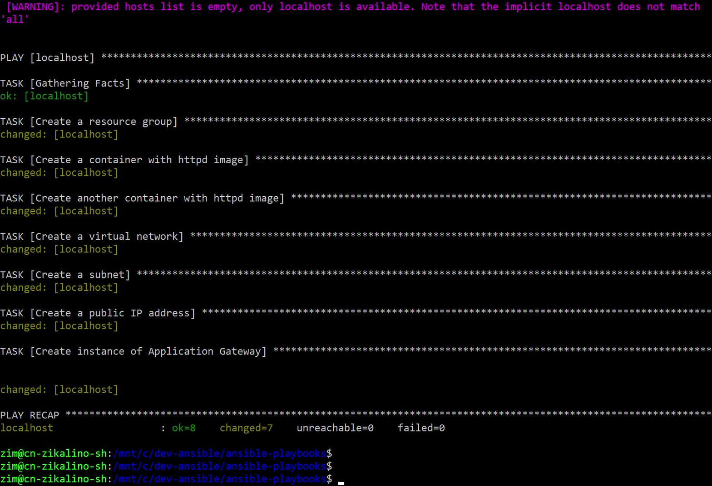
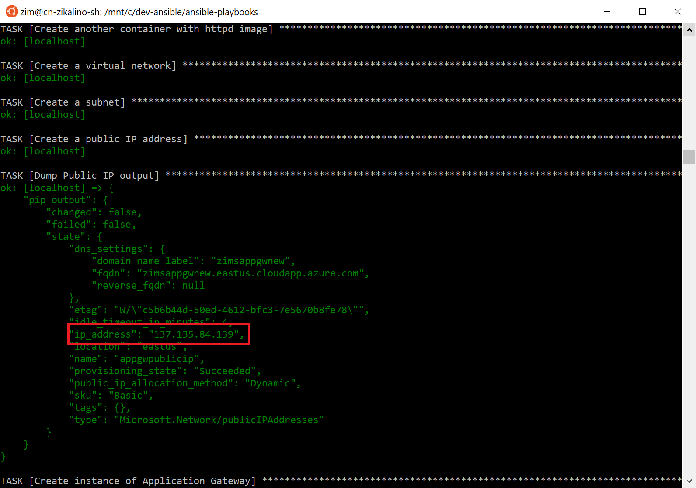
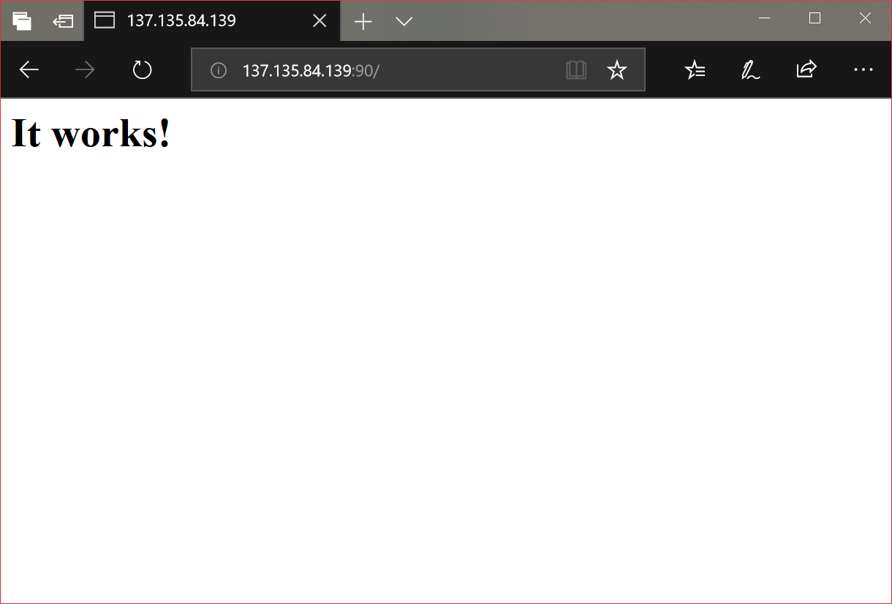

# Creating Application Gateway with Ansible Module

## Sample Playbook

Sample playbook is available in our samples repo here:

https://github.com/Azure-Samples/ansible-playbooks

## Prerequisites

Application Gateway needs a few existing resources:
- virtual network
- subnet

In addition we will use:
- Public IP Address, which is not required to create an instance of an application gateway, but will be useful to show how the whole solution is working in the web browser
- Two container instances created with **httpd** image - we will use these as a a backend.

## Creating Your First Application Gateway

Make sure you have Ansible 2.7 installed. After cloning samples repository, you will need to edit **appgateway_create.yml** file. Change **"{{ resource_group_name }}"** to your desired resource group, or define **resource_group_name** in a separate variable file.

Run the playbook:

```
ansible-playbook appgateway_create.yml
```



## How to Test It?

While creating Application Gateway we included a task that prints out the output of **azure_rm_publicipaddress** 



Go to the browser, type IP address with appended port **90**, and you shoudl see following page confirming that the infrastructure is working as expected.



## Backend Configuration

Backend configuration is defined by following parts:

```
    backend_address_pools:
      - backend_addresses:
          - ip_address: "{{ ci_output_a.ip_address }}"
          - ip_address: "{{ ci_output_b.ip_address }}"
        name: test_backend_address_pool
```

```
    backend_http_settings_collection:
      - port: 80
        protocol: http
        cookie_based_affinity: enabled
        name: sample_appgateway_http_settings
```

```
    request_routing_rules:
      - rule_type: Basic
        backend_address_pool: test_backend_address_pool
        backend_http_settings: sample_appgateway_http_settings
        http_listener: sample_http_listener
        name: rule1
```

## Frontend Configuration

Frontend configuration is defined by following parts of the playbook.

First of all **frontend_ip_configurations** associates our application gateway with public IP address that we had created before:

```
    frontend_ip_configurations:
        - public_ip_address: appgwpublicip
          name: sample_gateway_frontend_ip_config
```

Secondly we define listening port, in this case it's 90:

```
    frontend_ports:
      - port: 90
        name: ag_frontend_port
```

In final step we associate defined port with HTTP listener:

```
    http_listeners:
      - frontend_ip_configuration: sample_gateway_frontend_ip_config
        frontend_port: ag_frontend_port
        name: sample_http_listener
```

## Enabling HTTPS

To enable HTTPS we need to change HTTP Listener configuration, we need to add SSL certificate to our app gateway:

```
    ssl_certificates:
        - name: cert2
          password: your-password
          data: "{{ lookup('file', 'cert2.txt') }}"
```


```
    frontend_ports:
      - port: 443
        name: ag_frontend_port
```

In final step we associate defined port with HTTP listener:

```
    http_listeners:
      - frontend_ip_configuration: sample_gateway_frontend_ip_config
        frontend_port: ag_frontend_port
        name: sample_http_listener
        protocol: https
        ssl_certificate: cert2
```
