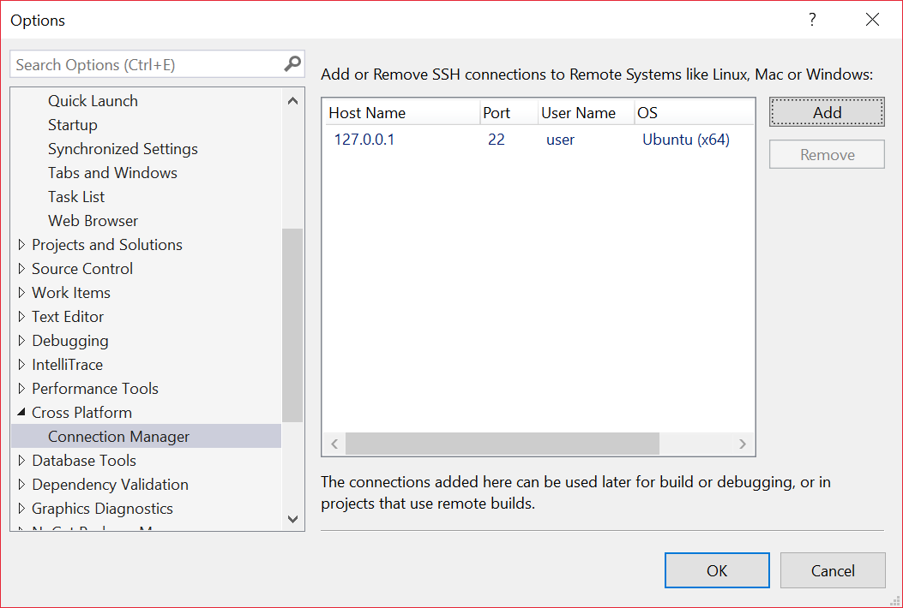

# Connecting to Azure IoT Hub using Linux

## Prerequisites

- Visual Studio 2017

- Linux Workload

- Azure IoT Hub Connected Service Extension

- Linux machine

## Create new application

### Create Linux Console Application Project

### Configure Azure IoT Hub connection

Right click on **References** and choose **Add Connected Service**

Select **Azure IoT Hub**

Login to **Azure** and select **Hardcode shared access key in application's code** and click **Next**.

Select or create **Azure IoT Hub** and click **Next**.

Select or create **Device** and click **Next**.

Summary screen shows useful information regarding selected IoT Hub and device, their connection strings, and code that is going to be generated. Press **Finish** to confirm.

Now the code has been generated. Go to **main.cpp** and add following code:

## Build and deploy application

To build the application you need Linux machine. You can just use an Ubuntu docker image with everything set up for you. Assuming you have **Docker** installed on your local machine, you can just type:

    docker run -t -i -p 22:22 --name ubuntu-azure-iot dockiot/ubuntu-azure-iot

Now you have to configure Visual Studio to use it as **Remote Build Machine**. From **Tools** menu select **Options**, then go to **Cross Platform** and select **Connection Manager** and press **Add**.

In **Connect to Remote System** dialog add settings as below.

Predefined password in our Docker container is **abcdef**.

Press **Connect**. If everything goes ok, new connection should appear as below:

Now you can close **Options** window and try to build the application.