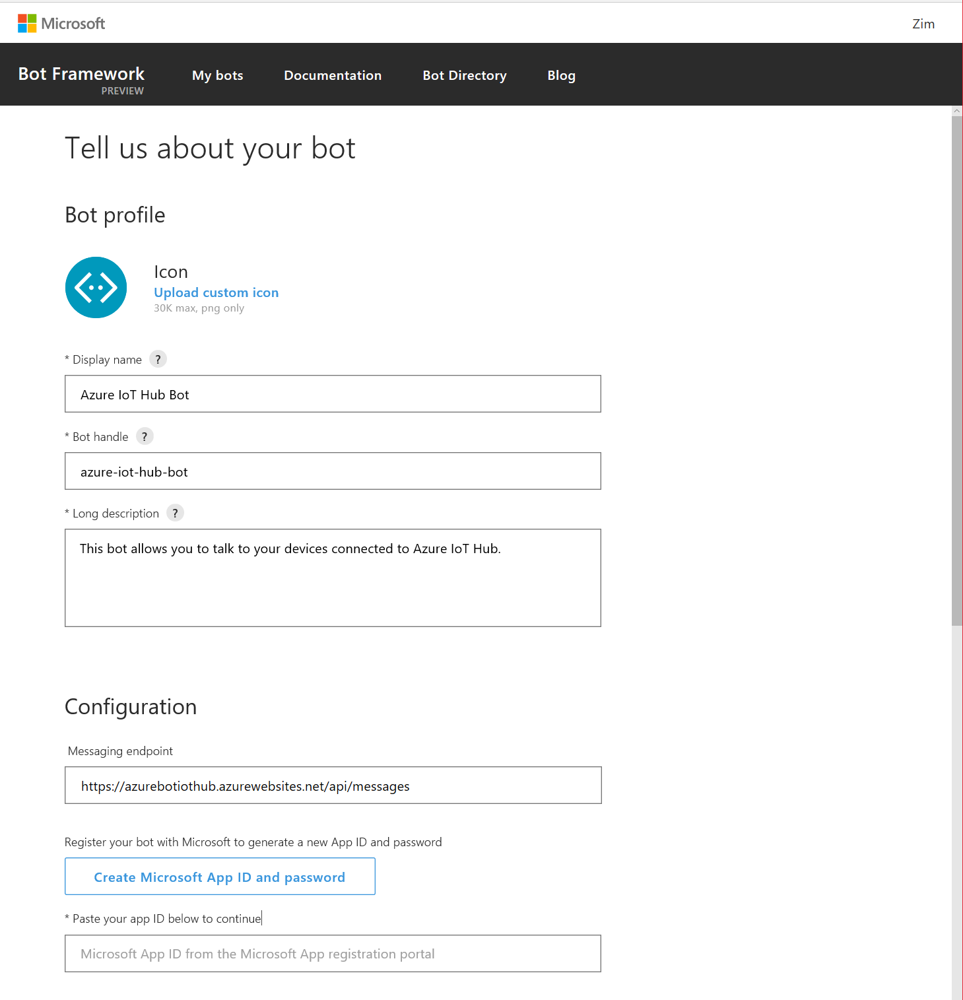

# Creating Azure IoT Hub Bot

## Background

This occured to me just a few days ago.

Currently there are no applications for my iPhone that would allow me communicating with Azure IoT Hub.
There is **Azure App** for iPhone, but the only thing you can do is to see a list of your IoT Hubs. Or maybe even this is not possible. So I was planning for a long time to make my contribution to **Azure App** and add IoT Hub related functionality, but now somehow occured to me that it would be even easier just to create **Azure IoT Hub Bot** and enable access to IoT Hub via many more channels than just iPhone or Android.

## So what's out there?

I started my research and found there's already available **Azure Bot**:

https://bots.botframework.com/bot?id=azurebot

It's more a sample bot as functionality is limited, as stated in overview:

    Be more productive with your own Microsoft Azure subscriptions using a natural language. Current support includes starting, stopping, and listing Azure VMs and starting Azure Automation runbooks. Note: Only supports Azure AD accounts, not Microsoft / MSA accounts.

It works with:
- Skype
- Slack
- GroupMe (I have to admit I have never heard about GroupMe)
- Microsoft Teams

I have tried the bot, and it already has one function I will need for my **Azure IoT Hub Bot**, and that is authentication. It works pretty nicely.

User can just type **login** and then click **Please click to sign in**, which causes redirection to standard Azure authentication interface in the browser. After logging he just has to copy the token back to Skype. And that's it.

## Deploying Azure Bot

The simplest approach to create **Azure IoT Hub Bot** is to build on existing project, which is available here (MIT License):

https://github.com/Microsoft/AzureBot

The only disadvantage is that the project is done in C# for ASP.NET. I would rather prefere Node.js and deploy it in Docker, as I have some other plans for the future, but for now it's the simplest way to build the prototype.

First step is obviously to clone, build and deploy the bot as it is just to see how the process works.

Ok, so I just clone and build the project using Visual Studio 2017. No complications here.

Now time for publishing. I have found following link:

https://docs.microsoft.com/en-us/azure/app-service-web/app-service-web-get-started-dotnet

I try to follow instructions, first I click on **Azure Bot** project and click **Publish**

But then I would like to publish to **Azure App Service** and it's simply not there....
It appeared I didn't have **Azure Development** workload installed, so if you don't have too, launch Visual Studio Installer to fix this problem.

... ok, here i have actually published my bot, but it's not properly configured yet. So the next step will be registration.

## Registering with Bot Framework

To register my bot I just went to https://dev.botframework.com/bots. Here just clicked **Register** to start the process. 

...then just filled basic information about Azure IoT Hub Bot

It's important to remember to enter proper messaging handle. It should look like **https://azurebotiothub.azurewebsites.net/api/messages**
Https and path are important. Otherwise the bot won't work. I made this mistake :-)

Well, and press **Create Microsoft App ID and password**.

Remember to copy **App ID** after it's generated, and click **Generate and app password to continue**.

Remember to store **password** after it's generated.

Now I just clicked **Register** to finalise, as I can add analytics later.

And voila! My bot is now created!

## Updating and Republishing the Bot

Now, one more detail is important. As we already know **App ID** and **password** it has to be inserted into the application. Right file is **Web.config**. One mistake I made was inserting these strings into **app.config** I found somewhere else. So check carefully if you're using right config file. See below:

As a last step before publishing I just wanted to modify welcome text:

And finally go to **CHANNELS** and use **Test** functionality to test my bot.

