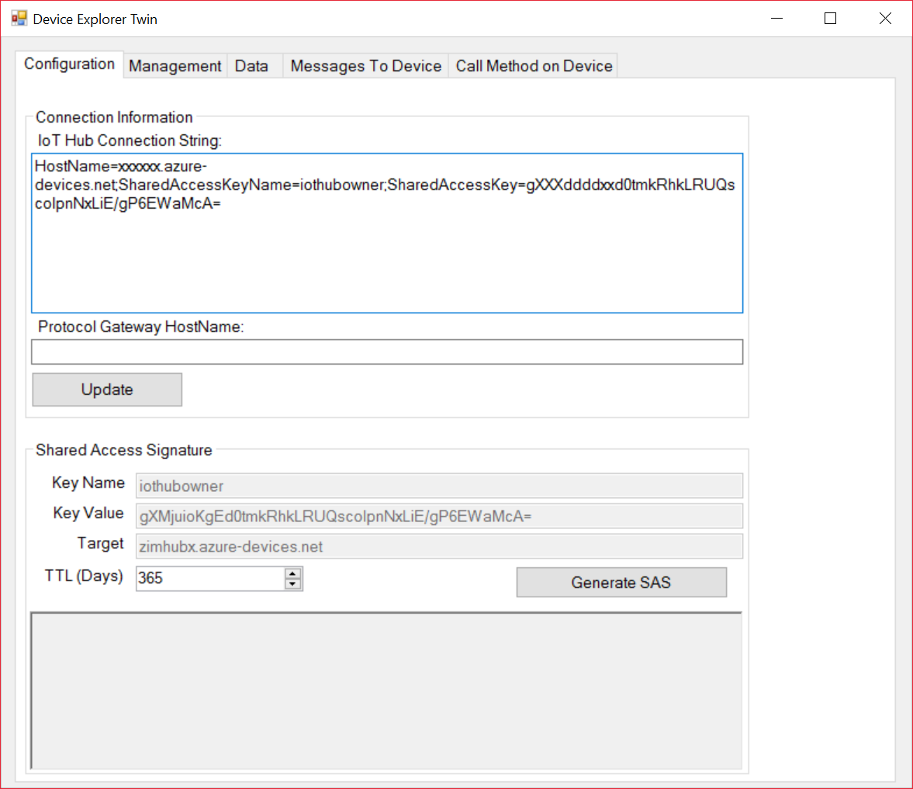
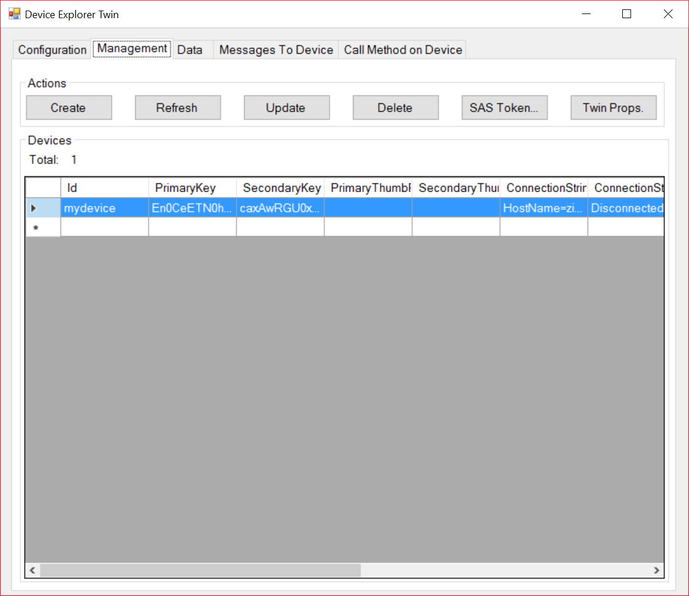
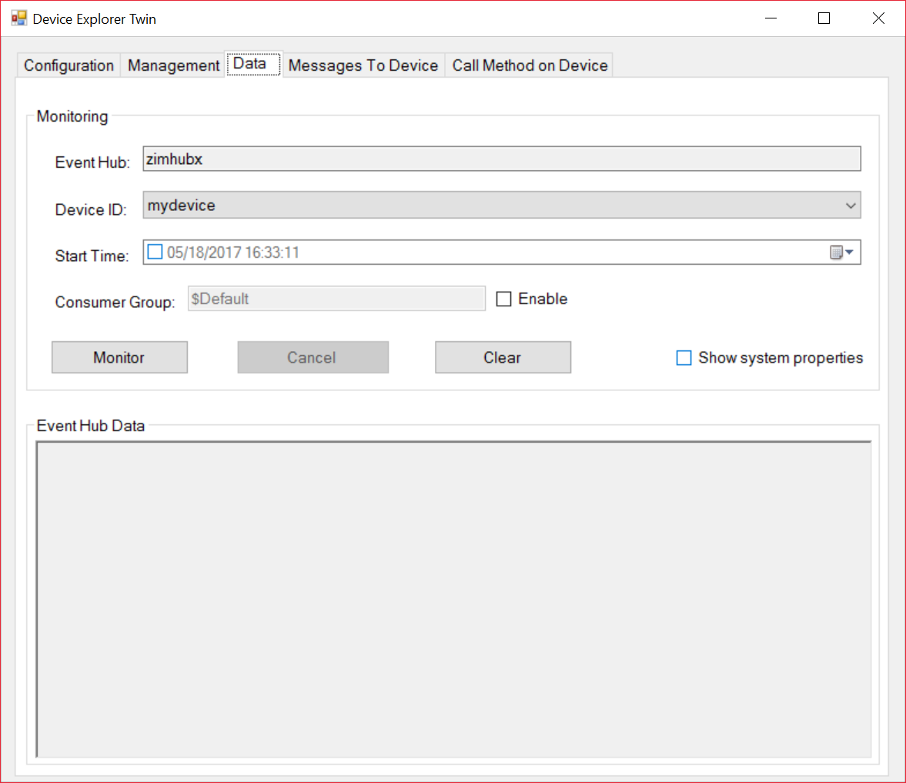
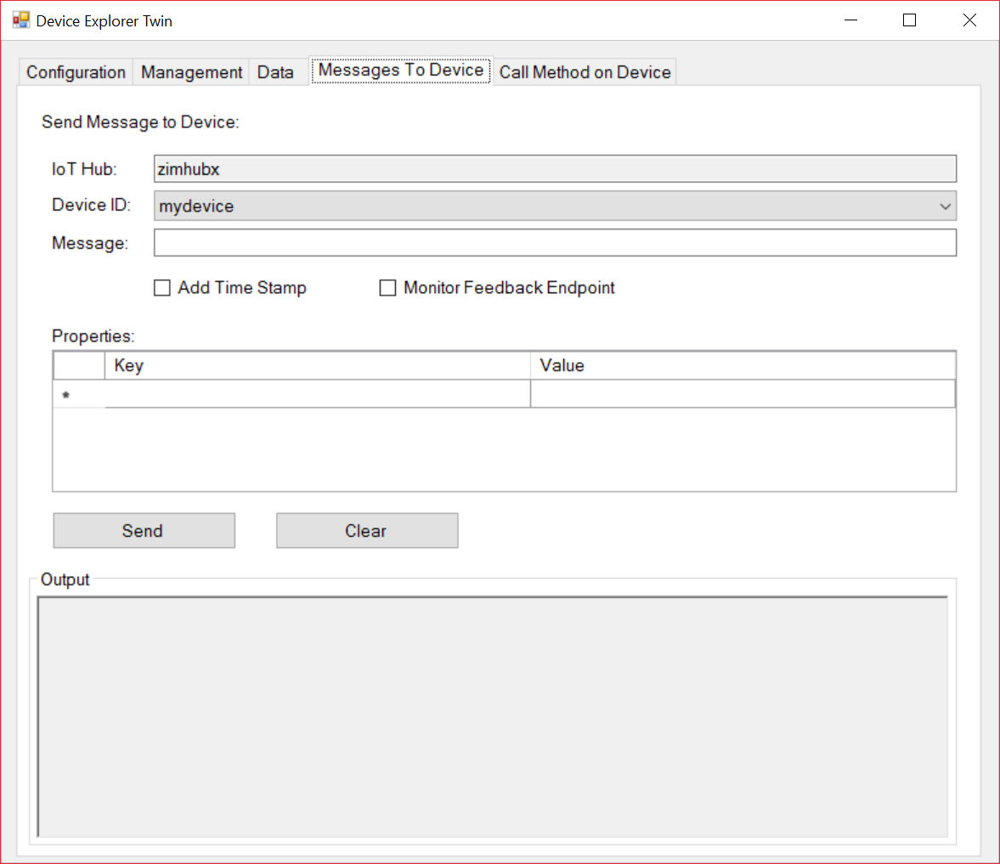
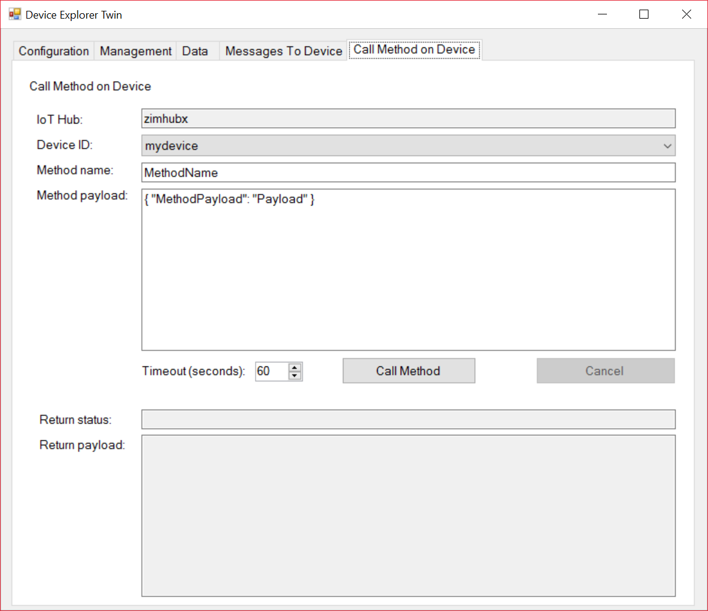

# IoT Hub Tools

## **Azure Portal**

* Create IoT Hub
* Create devices

## **IoT Hub Explorer**

### Repository

[https://github.com/azure/iothub-explorer](https://github.com/azure/iothub-explorer)

### Installation

    npm install -g iothub-explorer

### Disadvantages

    login                           start a session on your IoT hub
    logout                          terminate the current session on your IoT hub
    list                            list the device identities currently in your IoT hub device registry
    create <device-id|device-json>  create a device identity in your IoT hub device registry
    delete <device-id>              delete a device identity from your IoT hub device registry
    get <device-id>                 get a device identity from your IoT hub device registry
    import-devices                  import device identities in bulk: local file -> Azure blob storage -> IoT hub
    export-devices                  export device identities in bulk: IoT hub -> Azure blob storage -> local file
    send <device-id> <message>      send a message to the device (cloud-to-device/C2D)
    monitor-feedback                monitor feedback sent by devices to acknowledge cloud-to-device (C2D) messages
    monitor-events [device-id]      listen to events coming from devices (or one in particular)
    monitor-uploads                 monitor the file upload notifications endpoint
    monitor-ops                     listen to the operations monitoring endpoint of your IoT hub instance
    sas-token <device-id>           generate a SAS Token for the given device
    simulate-device <device-id>     simulate a device with the specified id

## **Device Explorer**

### What it can do?
* Create and manage devices
* Monitor messages sent by device
* Sending messages to the device
* Calling methods on the device
* Device twin management

### Disadvantages
* No simple login, need to get IoT Hub Connection string which has to be obtained using different method
* Can't create IoT Hub from here

### Configuration

## Azure CLI

