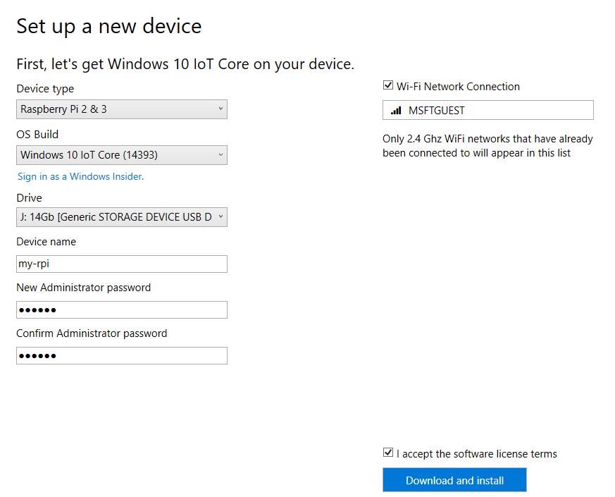

# IoT Hub Tools

||Azure Portal|IoT Hub Explorer|Device Explorer|Connected Service for IoT Hub|Azure IoT Toolkit for VSC|Azure CLI|IoT Dashboard|
|-|-|-|-|-|-|-|-|
|Windows|YES|YES|YES|YES|YES|YES|YES|
|Linux|YES|YES|-|-|YES|YES|-|
|Mac OS|YES|YES|-|-|YES|YES|-|
|Open Source|-|YES|YES|YES|YES|YES|-|
|Built In Login|YES|YES|-|YES|YES|YES|YES|
|Create IoT Hub|YES|YES|-|-|YES|YES|YES|
|Create Device in IoT Hub|YES|YES|YES|YES|YES|YES|YES|
|Delete Device from IoT Hub|YES|YES|YES|-|YES|YES|?|
|Monitor D2C Messages|-|YES|YES|-|YES|-|-|
|Send C2D Messages|-|YES|YES|-|YES|-|-|
|Provision Device|-|-|-|-|-|-|YES|
|Sample Code|-|-|-|YES|-|-|YES|

## **Azure Portal**

### Overview
* Managing IoT Hubs
* Managing Devices

### Disadvantages
* limited monitoring of D2C messages
* can't send C2D messages
* complicated and slow

## **IoT Hub Explorer**

### Overview

IoT Hub Explorer is a command line tool, written in Node.js.

Following functionality is available:

* login to IoT Hub
* list the device identities currently in your IoT hub device registry
* create a device identity in your IoT hub device registry
* delete a device identity from your IoT hub device registry
* get a device identity from your IoT hub device registry
* import device identities in bulk: local file -> Azure blob storage -> IoT hub
* export device identities in bulk: IoT hub -> Azure blob storage -> local file
* send a message to the device (cloud-to-device/C2D)
* monitor feedback sent by devices to acknowledge cloud-to-device (C2D) messages
* listen to events coming from devices (or one in particular)
* monitor the file upload notifications endpoint
* listen to the operations monitoring endpoint of your IoT hub instance
* generate a SAS Token for the given device
* simulate a device with the specified id

### Repository

[https://github.com/azure/iothub-explorer](https://github.com/azure/iothub-explorer)

### Installation

    npm install -g iothub-explorer

### Disadvantages

## **Device Explorer**

### What it can do?
* Create and manage devices
* Monitor messages sent by device
* Sending messages to the device
* Calling methods on the device
* Device twin management

### Disadvantages
* No simple login, need to get IoT Hub Connection string which has to be obtained using different method
* Can't create IoT Hub from here

## Azure CLI

This is a generic Azure command line tool.

### What it can do?
* Managing IoT Hubs
* Managing devices
* TBD - what else?

### Disadvantages
* pretty complex to use
* JSON output is not easy to read for human

## Azure IoT Toolkit for Visual Studio Code

Available from Visual Studio Code Marketplace

[https://marketplace.visualstudio.com/items?itemName=formulahendry.azure-iot-toolkit](https://marketplace.visualstudio.com/items?itemName=formulahendry.azure-iot-toolkit)

### What it can do?
* Send messages to Azure IoT Hub (device-to-cloud message)
* Monitor device-to-cloud messages
* Code snippet to send/monitor D2C message for IoT Hub
* Send messages to Azure Event Hub
* Monitor Event Hub messages
* Send/monitor messages from Azure IoT Hub to device (cloud-to-device message)
* Device management (List, Create, Delete)
* Discover devices connected via Ethernet, USB serial and WiFi
* Deploy and run in remote machine

## **Connected Service for Azure IoT Hub**

### Resources

[GitHub repository](https://github.com/Azure/azure-iot-hub-vs-cs)

[Version for Visual Studio 2015](https://marketplace.visualstudio.com/items?itemName=MicrosoftIoT.ConnectedServiceforAzureIoTHub)

[Version for Visual Studio 2017](https://marketplace.visualstudio.com/items?itemName=ZimKalinowski.ConnectedServiceforAzureIoTHub)

### What it can do?
* create and remove devices
* create sample code with embedded connectivity string
* support for C# and C++ projects (Windows and Linux)

### Disadvantages
* can't create IoT Hub
* no monitoring or sending messages to the device

## **IoT Dashboard**

[Infomation on IoT Dashboard](https://developer.microsoft.com/en-us/windows/iot/docs/iotdashboard)

### What it can do?

* Flash SD card with OS
* Configure WiFi connection on the device
* Create IoT Hub
* Create device in IoT Hub
* Configure IoT Hub connection on the device
* Deploy and run samples on the device

### Disadvantages
* works only with Windows 10 IoT Core
* no D2C message monitoring or C2D messages
* no public source code
